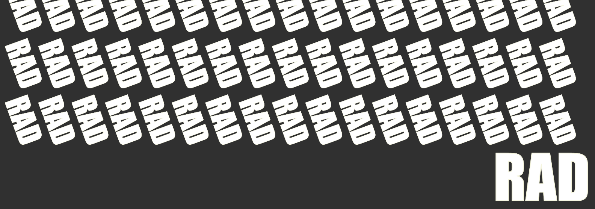

<!--NOSITE-->

<div style="text-align: center;width: 100%;"><!--NOSITE-->
   <a href="https://cdaringe.github.io/rad/" alt="docs page">rad - documentation site</a><!--NOSITE-->
 </div><!--NOSITE-->

# rad 💯

A general purpose build tool. Concise, statically typed, batteries included.
Command tasks, function tasks, and make-style tasks supported.

Jump to:

1. [Documentation site](https://cdaringe.github.io/rad/) <!--NOSITE-->
2. [Usage](#usage)
3. [Install](#install)
4. [What](#what-is-it)
5. [Why not `<my-favorite-build-tool>`?](https://cdaringe.github.io/rad/#why-not-my-favorite-build-tool)
6. [Manual](https://cdaringe.github.io/rad/#manual)

| branch | status                                                                                                                                         |
| ------ | ---------------------------------------------------------------------------------------------------------------------------------------------- |
| main   | [](https://github.com/cdaringe/rad/actions?query=workflow%3Amain)             |
| next   | [](https://github.com/cdaringe/rad/actions?query=workflow%3Anext) |

`rad@6.x` now supports `Deno@1.8.x+`!

## Usage

Rad is generally used as a CLI:

`$ rad <task-name> [--help]`

For example, `$ rad build` or `$ rad --log-level=info test`!

It can be used as a library too :).

Rad always consumes a `rad.ts` file, such as the one shown here:

```ts
// rad.ts
import { Task, Tasks } from "https://deno.land/x/rad/src/mod.ts";

// command/shell tasks
const format = `prettier --write`;
const test = `deno test`;

// function tasks
const compile: Task = {
  dependsOn: [format],
  fn: ({ sh, ...toolkit }) => sh("tsc"),
};
const greet = {
  fn: () => Deno.writeTextFile("/tmp/hello", "world"),
};

// make-style tasks
const transpile: Task = {
  target: "phony",
  prereqs: ["prereq1", "prereq2"],
  async onMake({ logger }, { changedPrereqs /*, prereqs */ }) {
    for await (const req of changedPrereqs) {
      logger.info(`req: ${req.path} ${req.isFile}`);
    }
  },
};

export const tasks: Tasks = {
  compile,
  format,
  greet,
  test,
};
```

## Install

There are a few formal ways to use `rad`. Regardless of the route you choose,
know that all strategies support using pinned versions, adherent to semver. See
the [releases page](https://github.com/cdaringe/rad/releases).

| usage   | install-method | install-steps                                                                                                                                                                                                                   |
| ------- | -------------- | ------------------------------------------------------------------------------------------------------------------------------------------------------------------------------------------------------------------------------- |
| cli     | `deno`         | `deno install --unstable -f -A -n rad https://raw.githubusercontent.com/cdaringe/rad/main/src/bin.ts`                                                                                                                           |
| cli     | `docker`       | `docker pull cdaringe/rad` <sup>1</sup>                                                                                                                                                                                         |
| cli     | `curl`         | <code>curl -fsSL https://github.com/cdaringe/rad/releases/download/v6.3.0/install.sh \| sh</code> (versioned)<br /><code>curl -fsSL https://raw.githubusercontent.com/cdaringe/rad/main/assets/install.sh \| sh</code> (latest) |
| library | `deno`         | `import * as rad from https://github.com/cdaringe/rad/blob/main/src/mod.ts`                                                                                                                                                     |

<sup>1</sup>For docker users, consider making a nice shell alias

```bash
# shell profile, e.g. .bash_profile
function rad() {
  docker run --unstable --rm -v $PWD:/rad cdaringe/rad --log-level info "$@";
}
```

## What is it

A build tool! It competes with make, npm-scripts, velociraptor, bazel, gradle,
ant, gulp, or any of the other many tools out there! On various metrics, `rad`
is subjectively better than some of the outstanding tools out there, and in some
cases, not-so-much. We invite you to understand some of its core characteristics
and interfaces.

`rad` offers:

- simple, **programmable** task interfaces
- **easy to understand**, declarative build steps
- **type-checked** tasks
- **no quirky DSLs** (`make`, `gradle`, and friends 😢). **your build is code**,
  not an arbitrary language or stringly (read: bummerly) typed script runner.
- productive toolkit API for nuanced tasks that benefit from programming. see
  [toolkit](#toolkit)<!-- @todo write toolkit docs-->
- bottom-up, `make`-style build targets
  - fast builds, skip redundant work when inputs haven't changed
- cli mode, or library mode
- portability. build automation for _any_ language or project, in many
  environments (\*limited to _Deno_ target architectures, for the time being.
  long term, we may package this in `Rust`)
- great UX
- debug-ability. 🐛 inspect your data, tasks, or even _rad_ itself
- employs a real scripting language--**not** `bash/sh`! shell languages are
  great for running other programs, not for plumbing data

See
[why not `<my-favorite-build-tool>`?](https://cdaringe.github.io/rad/#why-not-my-favorite-build-tool)

Read more on our [documentation site](https://cdaringe.github.io/rad/)

<!--NOSITE-->
